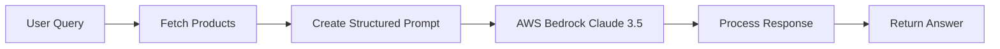

# AI-Powered Query Service

A production-ready microservice that integrates AWS Bedrock's Claude 3.5 Sonnet model to provide intelligent, context-aware responses about product catalogs. This service demonstrates modern cloud-native development with AI integration, containerization best practices, and enterprise-grade Kubernetes deployment.

## 🤖 AI Integration & Features

### AWS Bedrock Integration
This service leverages **AWS Bedrock** with **Claude 3.5 Sonnet** to provide intelligent query responses:

- **Model**: `anthropic.claude-3-5-sonnet-20240620-v1:0`
- **Real-time Processing**: Dynamically fetches product data and generates contextual responses
- **Intelligent Prompting**: Uses structured prompt engineering to ensure accurate, relevant responses
- **Error Handling**: Graceful fallback when AI services are unavailable

### AI Workflow


### Key AI Features
- **Context-Aware Responses**: AI understands the full product catalog context
- **Natural Language Processing**: Handles complex, conversational queries
- **Factual Accuracy**: Responses are grounded in actual product data
- **Scalable AI**: Serverless AWS Bedrock scales automatically with demand

### Example AI Interactions
```bash
# Natural language product search
GET /query?q=what is a good budget laptop for coding

# Comparison queries
GET /query?q=compare gaming laptops under $1500

# Feature-specific questions
GET /query?q=which phones have the best camera quality
```

## 🐳 Docker Best Practices Implementation

Our Dockerfile follows production-ready containerization patterns:

### Multi-Stage Build Strategy
```dockerfile
FROM node:20-slim AS builder  # Lightweight base image
WORKDIR /app
COPY package*.json ./         # Cache dependency layer
RUN npm ci --omit=dev        # Production dependencies only

FROM node:20-slim            # Clean final stage
WORKDIR /app
COPY --from=builder --chown=node:node /app/node_modules ./node_modules
```

### Security Best Practices
- **Non-Root User**: Runs as `node` user (UID 1000) for enhanced security
- **Minimal Base Image**: Uses `node:20-slim` to reduce attack surface
- **Proper Ownership**: Files owned by non-root user via `--chown=node:node`
- **No Unnecessary Packages**: Production-only dependencies with `--omit=dev`

### Performance Optimizations
- **Layer Caching**: Dependencies cached separately from application code
- **Minimal Image Size**: Multi-stage build eliminates build dependencies
- **Efficient Copying**: Strategic file copying to maximize Docker layer cache hits

### Production Readiness
- **Health Check Ready**: Exposes port 8002 for health monitoring
- **Environment Flexible**: Configurable via environment variables
- **Clean Shutdown**: Node.js process handles SIGTERM gracefully

## ☸️ Kubernetes Deployment Features

### Advanced Resource Management
```yaml
resources:
  requests:
    cpu: "200m"      # Guaranteed CPU allocation
    memory: "256Mi"   # Guaranteed memory allocation
  limits:
    cpu: "1000m"     # Maximum CPU usage
    memory: "512Mi"   # Maximum memory usage
```

### Production-Grade Health Monitoring
```yaml
startupProbe:
  httpGet:
    path: /query?q=startup
    port: 8002
  failureThreshold: 12    # Allows slow startup (2 minutes)
  periodSeconds: 10       # Check every 10 seconds
  timeoutSeconds: 10      # 10-second timeout per check
```

### Enterprise Security Features
- **Secret Management**: AWS credentials stored in Kubernetes secrets
- **Environment Isolation**: Service runs in dedicated namespace
- **Network Security**: Protected by NetworkPolicies (when implemented)
- **Non-Root Execution**: Container security context enforces non-root user

### High Availability & Scaling
- **Horizontal Pod Autoscaler Ready**: CPU and memory metrics exposed
- **Rolling Updates**: Zero-downtime deployments
- **Resource Quotas**: Guaranteed QoS class through proper resource definitions
- **Service Discovery**: ClusterIP service for internal communication

### Configuration Management
```yaml
env:
  - name: AWS_REGION
    value: "us-east-1"
  - name: AWS_ACCESS_KEY_ID
    valueFrom:
      secretKeyRef:
        name: aws-credentials
        key: AWS_ACCESS_KEY_ID
```

## 🚀 Getting Started

### Prerequisites
- Node.js 20+
- Docker & Docker Compose
- Kubernetes cluster (local or cloud)
- AWS Account with Bedrock access
- kubectl configured

### Local Development

1. **Clone and Install**
   ```bash
   git clone <repository-url>
   cd query-service
   npm install
   ```

2. **Configure AWS Credentials**
   ```bash
   export AWS_REGION="us-east-1"
   export AWS_ACCESS_KEY_ID="your-access-key"
   export AWS_SECRET_ACCESS_KEY="your-secret-key"
   ```

3. **Start the Service**
   ```bash
   npm start
   ```

4. **Test the AI Integration**
   ```bash
   curl "http://localhost:8002/query?q=what are the best laptops"
   ```

### Docker Deployment

1. **Build the Image**
   ```bash
   docker build -t query-service:latest .
   ```

2. **Run with Environment Variables**
   ```bash
   docker run -p 8002:8002 \
     -e AWS_REGION=us-east-1 \
     -e AWS_ACCESS_KEY_ID=your-key \
     -e AWS_SECRET_ACCESS_KEY=your-secret \
     query-service:latest
   ```

### Kubernetes Deployment

1. **Create AWS Credentials Secret**
   ```bash
   kubectl create secret generic aws-credentials \
     --from-literal=AWS_ACCESS_KEY_ID=your-key \
     --from-literal=AWS_SECRET_ACCESS_KEY=your-secret
   ```

2. **Deploy the Service**
   ```bash
   kubectl apply -f k8s/
   ```

3. **Verify Deployment**
   ```bash
   kubectl get pods -l app=query-service
   kubectl logs -f deployment/query-service-deployment
   ```

## 🔧 Configuration

### Environment Variables

| Variable | Description | Default | Required |
|----------|-------------|---------|----------|
| `AWS_REGION` | AWS region for Bedrock | `us-east-1` | ✅ |
| `AWS_ACCESS_KEY_ID` | AWS access key | - | ✅ |
| `AWS_SECRET_ACCESS_KEY` | AWS secret key | - | ✅ |
| `PRODUCT_SERVICE_HOST` | Product service hostname | `product-service` | ✅ |
| `HOST_QUERY` | Bind hostname | `0.0.0.0` | ❌ |

### AWS Bedrock Setup
1. Enable Bedrock in your AWS account
2. Request access to Claude 3.5 Sonnet model
3. Ensure your AWS credentials have `bedrock:InvokeModel` permissions

## 📊 Monitoring & Observability

### Application Metrics
- Response time tracking
- Error rate monitoring
- AWS Bedrock API usage
- Resource utilization (CPU/Memory)

### Health Checks
```bash
# Startup probe endpoint
GET /query?q=startup

# Application health
kubectl get pods -l app=query-service
kubectl top pods -l app=query-service
```

### Logging
```bash
# View application logs
kubectl logs -f deployment/query-service-deployment

# Follow logs across pod restarts
kubectl logs -f deployment/query-service-deployment --previous
```

## 🧪 CI/CD Pipeline

### GitHub Actions Integration
- **Automated Testing**: Unit tests, security scans, and integration tests
- **Docker Build**: Multi-architecture image builds
- **Kubernetes Deployment**: GitOps-style deployments with ArgoCD
- **Security Scanning**: Container vulnerability assessment

### Pipeline Features
- **SAST**: Static Application Security Testing with CodeQL
- **SCA**: Software Composition Analysis with Trivy
- **DAST**: Dynamic Application Security Testing with OWASP ZAP
- **Quality Gates**: ESLint, test coverage, and dependency checks

## 🔒 Security Considerations

### Application Security
- Input validation and sanitization
- Rate limiting on API endpoints
- Secure credential management
- Regular dependency updates

### Container Security
- Non-root user execution
- Minimal base image
- Regular image scanning
- Security context enforcement

### Kubernetes Security
- Network policies for traffic isolation
- RBAC for service access
- Secret encryption at rest
- Security context constraints

## 🤝 Contributing

1. Fork the repository
2. Create a feature branch (`git checkout -b feature/amazing-feature`)
3. Follow the established coding standards
4. Add tests for new functionality
5. Commit your changes (`git commit -m 'Add amazing feature'`)
6. Push to the branch (`git push origin feature/amazing-feature`)
7. Open a Pull Request


## 🆘 Troubleshooting

### Common Issues

**Q: AI responses are not working**
- Verify AWS credentials are correctly set
- Check Bedrock model access in your AWS region
- Ensure product-service is accessible

**Q: Container fails to start**
- Check resource requests vs. node capacity
- Verify all required environment variables are set
- Review pod logs for startup errors

**Q: High memory usage**
- Monitor Node.js heap usage
- Consider adjusting memory limits
- Check for memory leaks in application logs

### Support
- Open an issue in the repository
- Check the troubleshooting documentation
- Review the monitoring dashboards

---

**Built with ❤️ using AWS Bedrock, Node.js, Docker, and Kubernetes**
